# Trabajo Final Introducción a la Ciberseguridad

**Nombre**: Luciano Ganzero  
**Usuario en CTFd**: No recuerdo si era LucianoG o LGanzero.  
**Legajo**: 20430/3.  
**Año de cursada**: segundo semestre de 2024.  

## V1t CTF

### Waddler - PWN

**Flag**: v1t{w4ddl3r_3x1t5_4e4d6c332b6fe62a63afe56171fd3725}

El reto consiste en conectarte a un servidor remoto donde podemos enviar algo para que nos de una respuesta. Incluyen el ejecutable que está corriendo en el servidor remoto.  


Haciendo uso de las herramientas de **pwn** podemos analizar el ejecutable para ver varias cosas. Antes de eso, utilice la herramienta **strings** y al analizar la salida pude ver algunas cosas interesantes:  
  
Esto nos muestra que hay un archivo flag.txt al que accede el ejecutable de alguna manera, lo que nosotros debemos lograr es que llegue ahi. Seguramente haya una función que ejecute esa parte, y nosotros debemos lograr ejecutar esa función a través de un desbordamiento y sobreescribiendo la dirección de retorno. Usando **objdump** vemos una función llamada "duck" que es la que efectivamente hace eso. Lo que debemos averiguar ahora es, por un lado, el tamaño del buffer que debemos desbordar, y por otro, la dirección donde está "duck".  
Para esto si hacemos uso de **pwndgb**, ejecutando el archivo que nos brindan, y al hacer `info functions` vemos la dirección de duck. Como el ejecutable no tiene ninguna protección activada, salvo NX que para esto es indistinto, sabremos que en el servidor remoto, la función estará en el mismo lugar.  
  
Nos falta saber el tamaño del offset. Para esto podemos usar la herramienta **cyclic** y ver en que parte se rompe.  
 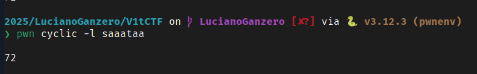  
Con todo esto en mente, armamos el template de pwn, que está en *Waddler/exploit.py*, para enviar al servidor remoto. Lo ejecutamos y obtenemos la flag.  
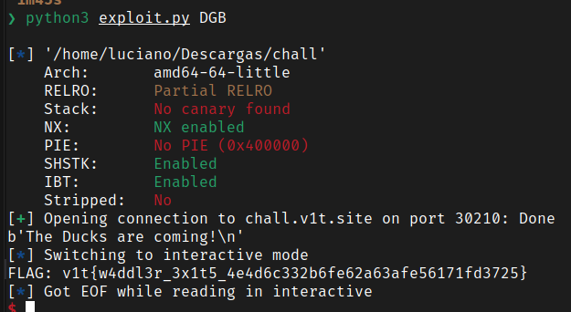

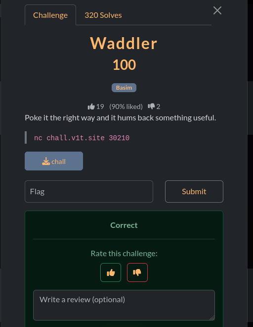

### PythonObf - Rev

**Flag**: v1t{d4ng_u_kn0w_pyth0n_d3bugg}
**Archivos**: obs.py

Es un challenge de ofuscación en Python. Me dan un script, que incluyo en la carpeta *PythonObf*, y la siguiente inscripción:  
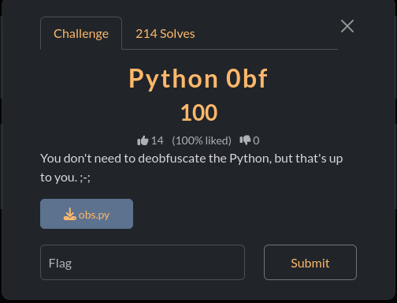  
El reto está compuesto de un payload encapsulado dentro de múltiples capas de `exec((_)(b'...'))`. Para no ejecutarlo y hacer una extracción segura, después de probar y comprobar que tenía más de una capa, armé un script para hacer un desempaquetado recursivo de los payloads hasta que finalmente se llegó al código base que contenía la flag.  
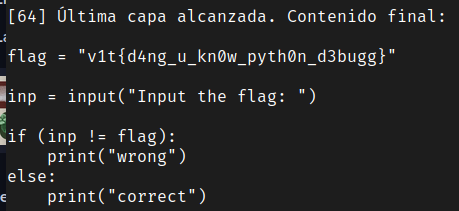

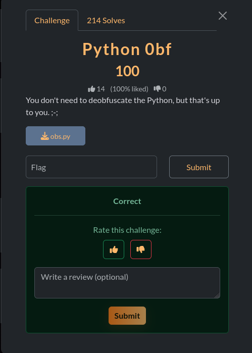

### Snail Delivery - Rev

**Inscripción**: "Enter your flag and the snail will deliver it to headquarters for verification. But be careful - it moves slowly!"
**Flag**: No lo pude resolver

Nos dan un binario llamado "snail".  
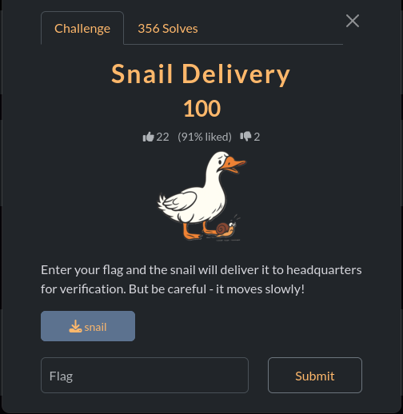  
Si lo ejecutamos, hace exactamente lo que dice la inscripción, moviéndose muy lento:  
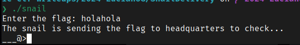  
Comenzamos el análisis estático ejecutando *strings* sobre el binario, encontramos algunas palabras que no sugieren que hay una solución dentro de la lógica del binario:  
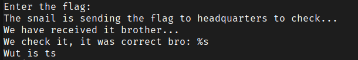  
El siguiente paso es analizarlo con el objdump, para ver como se comporta. De este análisis, observamos varias cosas:

- La salida del main es bastante larga, porque incluye la animación del caracol que se va construyendo, y un sleep que va aumentando exponencialmente.
- Podemos interpretar que el binario toma la cadena que le enviamos, le aplica una serie de XOR con una clave y la compara contra una cadena hardcodeada que tiene almacenada.
- Por tanto, lo que deberiamos hacer para reconstruir la clave es el proceso inverso: tomar la cadena hardcodeada y aplicarle el XOR reverso para obtener la flag.

Armamos un script para hacer esto, pero no puedo terminar de reconstruir la flag: hay algunos caracteres incorrectos que no puedo corregir, y eso hace que la flag falle.

### Login - Web

**Flag**: v1t{p4ssw0rd}

Para resolver el reto nos dan una URL donde debemos loguearnos. Cuando analizamos la página en cuestión, vemos que no tiene ningún contenido en el body salvo un **script**.  

```javascript
    async function toHex(buffer) {
      const bytes = new Uint8Array(buffer);
      let hex = '';
      for (let i = 0; i < bytes.length; i++) {
        hex += bytes[i].toString(16).padStart(2, '0');
      }
      return hex;
    }

    async function sha256Hex(str) {
      const enc = new TextEncoder();
      const data = enc.encode(str);
      const digest = await crypto.subtle.digest('SHA-256', data);
      return toHex(digest);
    }

    function timingSafeEqualHex(a, b) {
      if (a.length !== b.length) return false;
      let diff = 0;
      for (let i = 0; i < a.length; i++) {
        diff |= a.charCodeAt(i) ^ b.charCodeAt(i);
      }
      return diff === 0;
    }

    (async () => {
      const ajnsdjkamsf = 'ba773c013e5c07e8831bdb2f1cee06f349ea1da550ef4766f5e7f7ec842d836e'; // replace
      const lanfffiewnu = '48d2a5bbcf422ccd1b69e2a82fb90bafb52384953e77e304bef856084be052b6'; // replace

      const username = prompt('Enter username:');
      const password = prompt('Enter password:');

      if (username === null || password === null) {
        alert('Missing username or password');
        return;
      }

      const uHash = await sha256Hex(username);
      const pHash = await sha256Hex(password);

      if (timingSafeEqualHex(uHash, ajnsdjkamsf) && timingSafeEqualHex(pHash, lanfffiewnu)) {
        alert(username+ '{'+password+'}');
      } else {
        alert('Invalid credentials');
      }
    })();
```

En el script, vemos que nos pide un username y una password, a eso le aplica un hash SHA256 y lo compara con las variables donde tiene guardado el hash del username y la password. Por tanto, lo que debemos hacer es buscar la palabra que, al aplicarle el hash SHA256, sea igual a los hashes ahi expuestos. Hay diferentes herramientas online que pueden hacer eso, entre ellas "hashes.com".  
Buscamos ambos hashes y obtenemos el username y la password:  
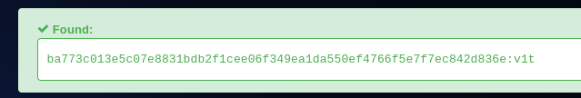
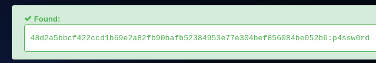  
Una vez obtenidas, nos logueamos y eso nos devuelve la flag:  
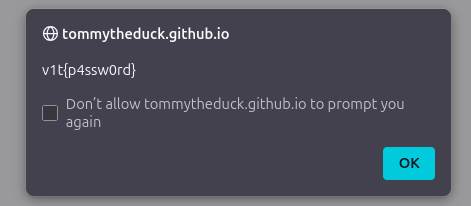  
Que nos permite completar el ejercicio:  
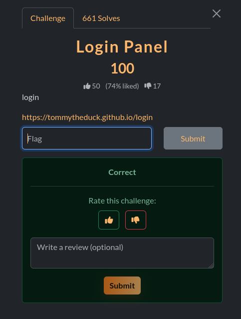

## m0leCon Begginer CTF

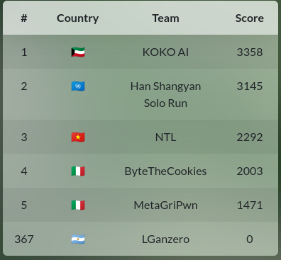  

### Dragon Quest - PWN

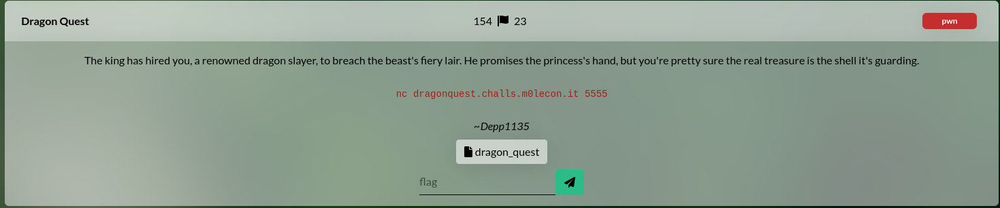  

**Flag:** ptm{50rry_Sl4y3r_Y0ur_Pr1nc3ss_1s_1n_4n0th3r_B1n4ry}
**Archives:** binario dragon_quest

El reto consiste en una conexión netcat a una URL y un puerto donde tenemos que "enfrentarnos" con un dragón. Tenemos una serie de opciones, que nos permiten aprender un hechizo, olvidarlo, listar nuestros hechizos, pelear o escapar. A todo esto, nos dan el archivo que se ejecuta en el servidor remoto para analizar.  
Comenzamos haciendo un análisis con **strings**, y ya vemos algunas cosas interesantes:  

- Entre los strings vemos **gets**, lo que puede permitirnos algún tipo de overflow.
- Hay una linea que dice **The dragon staggers at a cursed number: 3337. Reality glitches. Whisper your final taunt:**, lo que nos indica que ese número puede ser importante para que se dispare algo.
- También encontramos **system** y **/bin/sh** dentro de los strings, asi que quizás podemos conseguir una terminal.
- No encontramos nada referido a la flag dentro de los strings.  

Analizando ahora con **objdump** vemos otra seria de cosas importantes:

- Dos cosas que sabia solo por jugarlo: la salud inicial del dragón es 10000 y tengo 5 turnos para dañarlo.
- Si dejo la salud en 0, llama a **win**  
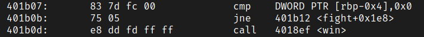
- En el flujo normal del programa, no podría dejarle la salud en 0, ya que el daño máximo del hechizo es 1999.
- Si después de los 5 turnos, dejo la salud en 3337, consigo la llamada al gets, el punto vulnerable  
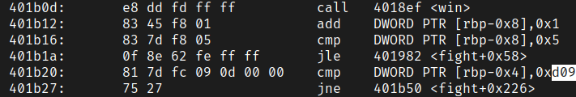

Como ya vimos en el strings, la cadena **bin/sh** ya esta en el binario, por lo que dejo ingresar un exploit que me permita cargar esa cadena en system y obtener una terminal.  
Para armar mi exploit, voy a necesitar las direcciones de system y de la cadena, que puedo obtenerlas con del mismo **objdump**, y la distancia o el offset hasta el tope de la pila, que puedo obtenerlo ejecutando el programa con un **pwntemplate** y enviandole un cyclics cuando logre ejecutar el gets, asi calcular el desborde.
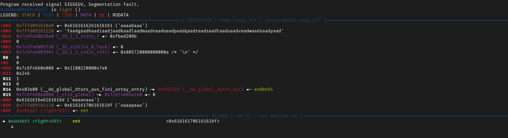  

Después de intentar bastante este approach y no conseguirlo, volví a mirar el objdump y vi que la función **win** ya hace un llamado a **system**, por lo que no es necesario que yo haga el llamado a system cargandole la cadena, sino que solo debo sobreescribir la dirección de retorno con la de win, que ya hace esto por mi. A esto tuve que sumarle un gadget de ret para alinear la pila, pero finalmente funcionó.  
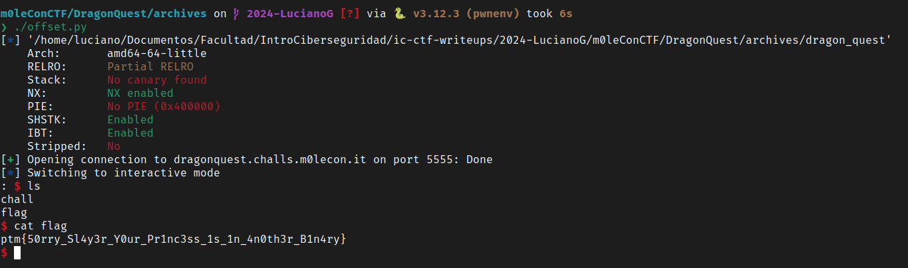  
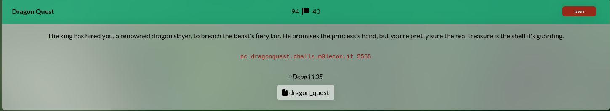  
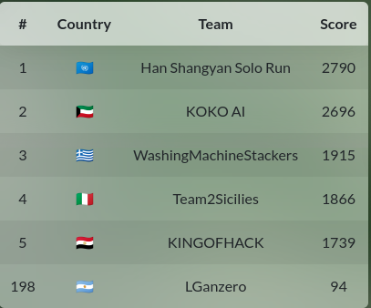  

No vi el horario al comenzar y se terminó el CTF antes que pudiera resolver otros retos.

## PascalCTF

### Malta Nightlife - pwn

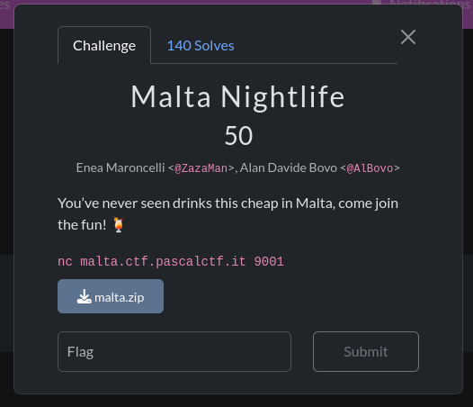  

**Flag**: pascalCTF{St0p_dR1nKing_3ven_1f_it5_ch34p}
**Archivos**: me dan el ejecutable **malta**.

El reto consiste en una conexión a un servidor remoto. Allí se ejecuta un programa donde nos dan una "lista de precios". Nosostros contamos con €100, mientras que la flag sale mucho más.  
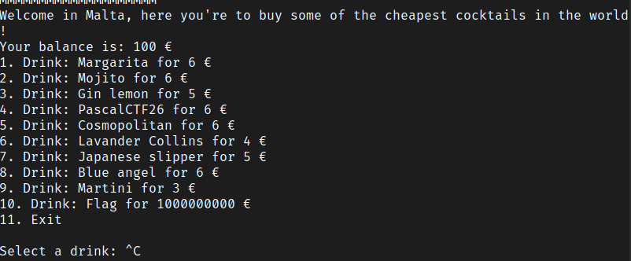  

Hacemos un análisis estático con las herramientras **strings** y **objdump** y ahí comprobamos algunas cosas:

- Se usa getenv("FLAG") y se guarda en el array de recetas. Entonces, necesitamos una variable de entorno FLAG para ejecutarlo en local.
- Si la variable FLAG no existe, el programa termina con “No flag found”.
- En main se toma la opción con scanf("%d"), luego se pide la cantidad y se calcula el total así:

```
total = cantidad * precio   (con imul de 32 bits)
balance -= total
```

Esto es muy importante porque tanto cantidad como precio son ints, por lo que el total puede hacer integer overflow. Es decir, el cálculo del costo se hace en 32 bits con signo. Si elegimos una cantidad suficientemente grande, el producto cantidad * precio desborda y se vuelve negativo. Si total es negativo, en realidad se va a sumar dinero a nuestra cuenta y nos va permitir "comprar" la flag. Integramos esto en un template de pwn y efectivamente nos da la flag:  
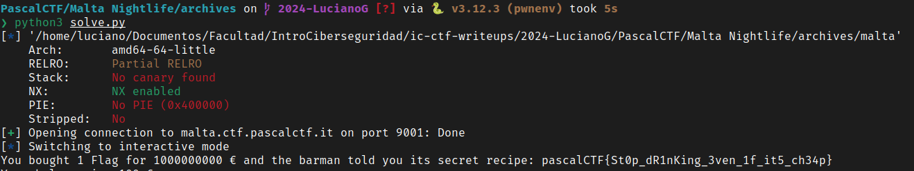

La ponemos en el reto y lo solucionamos:  
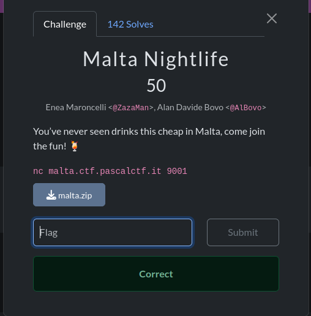  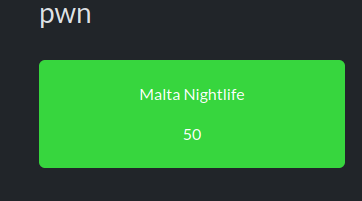  
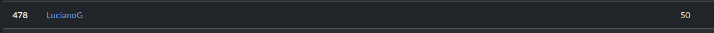  

### AuraTester 2000 - Reversing

**Flag**: pascalCTF{Y0u_4r3_th3_r34l_4ur4_f1n4l_b0s5}
**Archives**: nos dan un archivo *AuraTester.gyat*

El reto consiste en una conexión a un servidor remoto donde nos haces una serie de preguntas para determinar si tenemos "aura". Al contestar esas preguntas nos da una frase secreta que tenemos que decodificar para ganar el premio.  
El archivo que nos dan es un archivo de texto:  
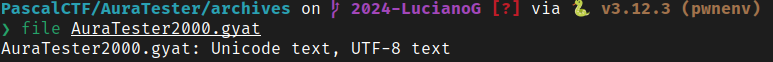  
Que al aplicarle **strings** nos permite ver una suerte de código Python pero "memificado", o con frases meme en el medio. Aun asi, permite entender la lógica del programa:
Lo que hace es generar una frase aleatoria con 3-5 palabras de una lista fija, generar un número random de *steps* entre 2-5 y luego codificar la frase con la función *encoder* en base a la cantidad de steps.  
Necesitamos, al menos, 500 de aura para tomar el test, y las preguntas tienen un valor fijo. Contestando todas "bien", podemos sumar 700 de aura y tomar el test.  
Cuando nos devuelve la frase, tenemos que desencodearla, y para eso debemos ver que hace el encoder:  
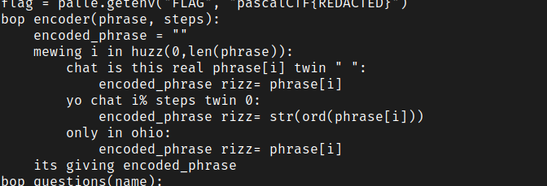  
Basicamente, si es un espacio se deja igual; si el resto del índice divido la cantidad de steps es 0, se reemplazar con el caracter ASCII; y si no, se deja igual.  

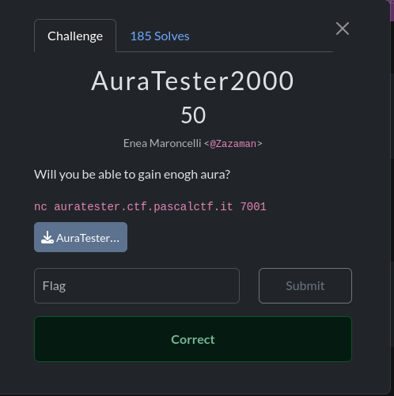  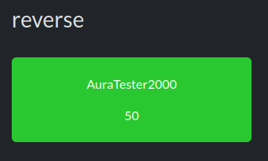  
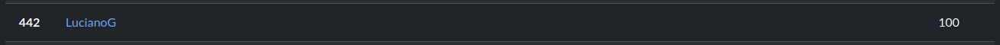

### JSHIT - Web

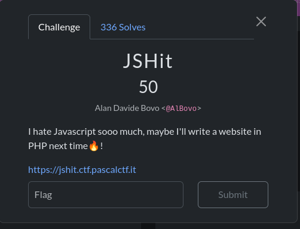  

**Flag**: pascalCTF{1_h4t3_j4v4scr1pt_s0o0o0o0_much}
**URL**: https://jshit.ctf.pascalctf.it

Al entrar a la pagina, solo muestra un título y la línea "You got no flag yet lol", mientras que en la consola hay un texto que dice "where's the page gone?". Si analizmaos el HTML, vemos que contiene un único script que es JSFuck, que es Javascript ofuscado. Armamos un script para deosfucar y mostrar el código generado:

```javascript
() => {
  const pageElement = document.getElementById('page');
  const flag = document.cookie.split('; ').find(row => row.startsWith('flag='));
  const pageContent = `<div class="container"><h1 class="mt-5">Welcome to JSHit</h1><p class="lead">${flag && flag.split('=')[1] === 'pascalCTF{1_h4t3_j4v4scr1pt_s0o0o0o0_much}' ? 'You got the flag gg' : 'You got no flag yet lol'}</p></div>`;
  pageElement.innerHTML = pageContent;
  console.log("where's the page gone?");
  document.getElementById('code').remove();
}
```

Vemos que compara si una cookie está seteada con un valor harcodeado, que es la flag, y si lo está en lugar de decirte que no tenes la flag, te dice que ya le tenes. Seteamos la cookie, solo para ver el cambio, porque la flag está hardcodeada en el código ofuscado.  
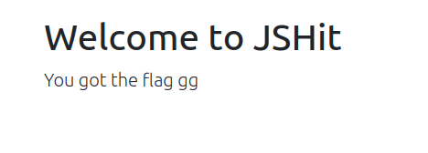  

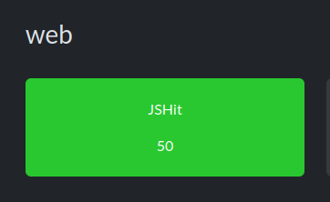  
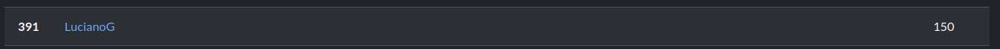  

## Reflexiones finales

Tengo que señalar que el trabajo final fue muy desafiante e incluso por momentos un poco frustrante. Si bien cabe decir que creo que he aprendido mucho y ha sido muy útil en ese sentido, el caracter un poco arbitrario de los CTF lo hizo muy complicado por momentos. Me paso varias veces de comenzar un CTF y quedarme sin tiempo, también me paso mucho de poder resolver uno o dos ejercicios y no poder resolver un tercero. Finalmente tuve la suerte de encontrar un CTF muy simple para completarlo, pero había llegado a un punto de frustración por estar trabajando todo un fin de semana con algunos ejercicios y no lograr completar los tres requeridos, o las condiciones requeridas para que cuente. El caracter efímero de los CTF, si bien entendible, hace que sea muy difícil consultar, el hecho de que la enorme mayoría sea en los fines de semana tampoco ayuda. Por lo que creo que en ese sentido se podría quizás ajustar las condiciones para hacerlas más flexibles, que no más fáciles: quizás que sea una cantidad de retos totales, en lugar de x cantidad de retos en x CTFs; o tener en cuenta los puntos, o alguna otra posibilidad.  
Más allá de eso, fue muy entretenido, una variante interesante para cambiar la modalidad de evaluación. Me obligó a releer muchas veces el material, ya que de un intento a otro quizás pasaba bastante tiempo y tenía que repasar. También a usar bastante distintos LMM, un proceso bastante frustrante en sí mismo, pero que fueron de mucha ayuda para muchos retos.
